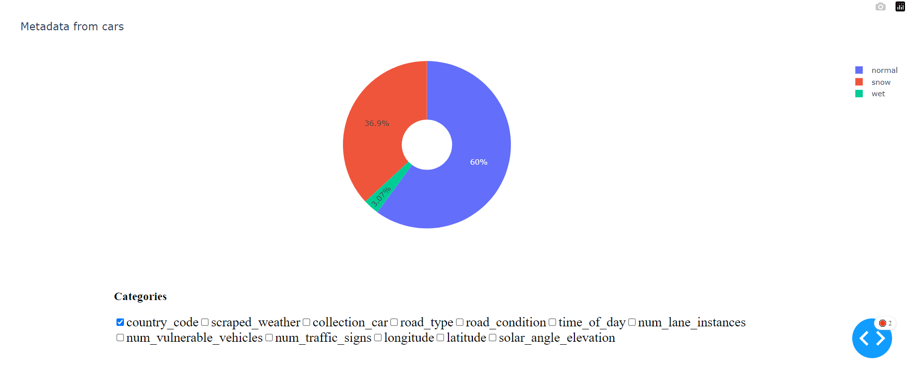
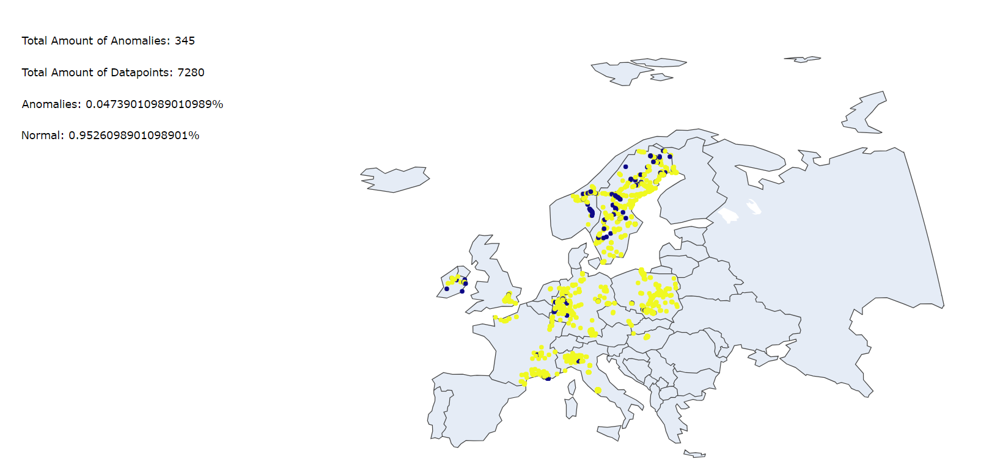
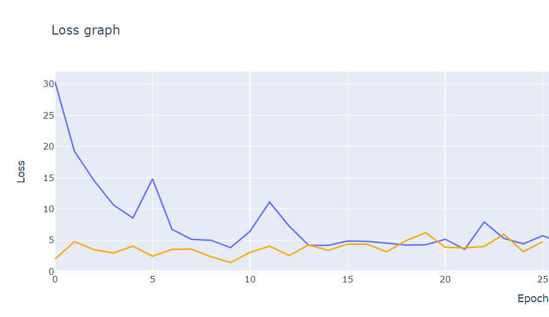

# Fleet learning - Eskilstuna

Fleet learning is a project in collaboration with Zenseact and Volvo. They use federated learning technology to train ML models on cars all around the world.

In this project, the goal has been to minimize the loss of their ML model by implementing client selection strategies, visualizing data & finding outliers/anomalies.

## Table of contents

- [ Setup ](#setup)
- [ Sectors ]()
    1. [ Metadata visualization ](#metadata-visualization)
    2. [ Client selection strategies ](#selection)
    3. [ Novelty detection ](#outliers)
- [ Acknowledgements ](#acknowledgements)
- [ Contributors ](#contributors)

## Setup

**Installation**

1.Clone the repository
2.Open the directory in a terminal

    cd fleet-learning-young-talents

3.Install dependencies
    
    pip install -r requirements.txt

**Usage**

Running the model

    python3 main.py

Running the dashboard

    python3 metadata_visualization.py

By default, the dashboard is made available on `http://127.0.0.1:8051/`

The port can be changed by setting the port argument of the `app.run_server()` function

## Metadata visualization

### Dashboard 

The dashboard was originally developed by our colleagues in Örebro. We took inspiration from their solution and made our own dashboard, to showcase other aspects and features of the data.

Our version consists of three sections:

#### The multi-selection graph

The multi-selection graph, which allows users to combine different features from the metadata, so that the information from chosen clients can be seen from new perspectives.

#### Outlier map

A world map, which displays all the data points and their locations. Points which have been classified as anomalies are highlighted in blue, and the remaining ones are yellow.

The outliers have been identified by the isolation forest algorithm from the scikit-learn library.

#### Performance graph 

Visualization of the training loss, validation loss & test loss from the model

*Note: validation loss is not included in this image*

**To do:**

- Make it possible to isolate training loss from testing loss

- Show parameters used for the selected training session

- Show mean values + min & max values

## Client selection strategies

We have developed two different client selection strategies:

- Client selection based on location
- Client selection based on parameters such as road condition, weather and time of day

## Novelty detection

Using the isolation forest algorithm, we have created a method which isolates data points that deviate from the norm in the dataset. 

The features used to detect outliers are extracted from the metadata:

- Road condition
- Scraped weather
- Time of day
- Country code

The function which classifies data points is located in the module novelty_detection.py

## Acknowledgements

To create the dashboard and graphs, we used plotly and dash. To perform clustering and outlier detection, we used the Scikit-learn library.

* [Plotly](https://plotly.com/)
* [Dash](https://dash.plotly.com/)
* [Scikit-learn](https://flexbox.malven.co/)

## Contributors

* [Gustav Jakobsson](https://github.com/gusjak251)
* [Pontus Wallin](https://github.com/PontusWallin1)
* [August Wanger](https://github.com/AugustWanger)